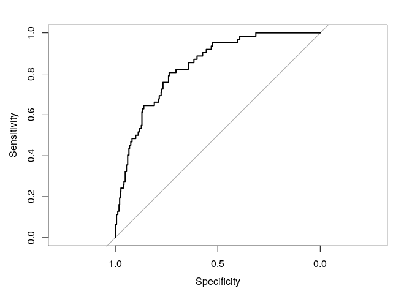
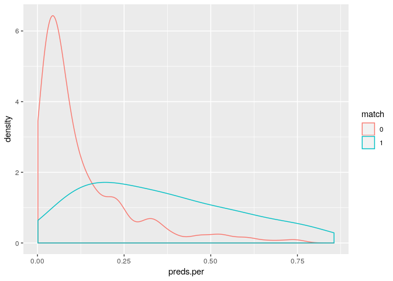

Final Project Data Science
================
Lieke van Uden, Felix Ude
January 15, 2019

We begin by loading our libraries.

``` r
library(dplyr) 
library(caret)
library(e1071)
library(DMwR)
library(pROC)
library(ROCR)
library(ggplot2)
library(SDMTools)
```

Import our dataset

``` r
set.seed(8888)
data <- read.csv(file="~/repos/nccu-datascience/data_science_final/Speed_Dating_Data.csv", header = TRUE, sep = ",") 
```

Set NA in two columns to the corresponding value of "Other"

``` r
data[is.na(data$career_c), "career_c"] = 15 
data[is.na(data$field_cd), "field_cd"] = 18 
```

Creating one new Variable for progress of dates during evening

``` r
data$progress <- as.numeric(data$order/data$round)
```

Creating a list of columns to keep for each partner of the date.

``` r
col_both <- c("iid_pid", "age", "gender", "race", "field_cd", "mn_sat", "imprace", "imprelig", "income", "goal", "date","go_out", "career_c", "exphappy", "attr3_1", "sinc3_1", "intel3_1", "fun3_1", "amb3_1", "progress", "sports","tvsports", "exercise", "dining", "museums", "art", "hiking", "gaming", "clubbing", "reading", "tv", "theater","movies", "concerts", "music", "shopping", "yoga", "attr1_1", "sinc1_1", "intel1_1", "fun1_1", "amb1_1","attr5_1", "sinc5_1", "intel5_1", "fun5_1", "amb5_1", "attr", "sinc","intel", "fun", "amb", "like" )
partner2_col <- col_both
partner1_col <- c("pid_iid", "samerace", "match", col_both) 
```

Merging the entries of a partner with the other one.

``` r
#create partner id
data$iid_pid = paste(data$iid, data$pid, sep = "_") 
data$pid_iid = paste(data$pid, data$iid, sep = "_") 
# merge dataframe on partner id
merge_data = merge(data[, partner1_col], data[, partner2_col], by.x = "pid_iid", by.y = "iid_pid") 
# remove double entries
merge_data = merge_data[!(merge_data$gender.x == 1 ),] 
merge_data <- merge_data[complete.cases(merge_data),] # remove all rows with NA
```

Create more variables for differences between the two partners.

``` r
# create var for age difference
merge_data$age_diff <- merge_data$age.x - merge_data$age.y 
# create var for career difference
merge_data$career_diff <- 0 
merge_data[merge_data$career_c.x == merge_data$career_c.y, "career_diff"] = 1 
# create var for field difference
merge_data$field_diff <- 0 
merge_data[merge_data$field_cd.x == merge_data$field_cd.y, "field_diff"] = 1 

# create other difference var
differences = c("age","sports","tvsports","exercise","dining","museums","art","hiking","gaming","clubbing","reading","theater","movies","concerts","music","shopping","yoga","tv", "mn_sat", "imprace", "imprelig", "income", "exphappy")

for (i in differences){
merge_data[paste(i,"_diff", sep = "")] = abs( as.numeric(merge_data[,paste(i,".x",sep = "")]) - as.numeric(merge_data[,paste(i,".y",sep = "")])  )

}
# delete vars which are no longer needed
# (gender is not required, since X is always male)
for (i in c("pid_iid", "iid_pid", "pid", "iid", "gender.x", "gender.y")){
merge_data[,i] <-  NULL
}
```

``` r
# create list of numeric variables with difference
numeric_var = c()
for (i in (differences)){
  numeric_var[length(numeric_var) + 1] = paste(i,".x",sep = "")
  numeric_var[length(numeric_var) + 1] = paste(i,".y",sep = "")
  numeric_var[length(numeric_var) + 1] = paste(i,"_diff",sep = "")

}
# create list of numeric variables without difference
for (i in c("attr3_1", "sinc3_1", "intel3_1", "fun3_1", "amb3_1","attr1_1", "sinc1_1", "intel1_1", "fun1_1", "amb1_1", "attr5_1", "sinc5_1", "intel5_1", "fun5_1", "amb5_1", "progress",  "attr", "sinc", "intel", "fun", "amb", "like")){
  numeric_var[length(numeric_var) + 1] = paste(i,".x",sep = "")
  numeric_var[length(numeric_var) + 1] = paste(i,".y",sep = "")

}
```

Scale numeric data and convert factor variables

``` r
# scale data
merge_data[,numeric_var] <- lapply(merge_data[,numeric_var], as.numeric)
scl <- function(x){ (x - min(x))/(max(x) - min(x)) }
merge_data[, numeric_var] <- data.frame(lapply(merge_data[,numeric_var], scl)) 

# list of factor variables
n <- names(merge_data) 
factor_var <- n[!n %in%  numeric_var]
merge_data[, factor_var] <- lapply(merge_data[,factor_var], as.factor)
# creatte formula with required vars
n <- colnames(merge_data) 
f <- as.formula(paste("match ~", paste(n[!n %in% c("match")], collapse = " + "))) 
```

Creating Training and Test Data

``` r
smp_size <- floor(0.8 * nrow(merge_data))
train_ind <- sample(seq_len(nrow(merge_data)), size = smp_size)
train <- merge_data[train_ind, ]
test <- merge_data[-train_ind, ]
results <- data.frame(AUC = double(), Thresh = double())
```

We are using a support Vector Machine to train our data. The best tuning values where previously tested using the tune.vsm function. To make sure our results are corrected we will implement a 10-Fold Cross-Validation.

``` r
tune_svm <- tune.svm(f, data = train, kernel = "radial", scale = FALSE, cost = seq(1,61, by = 10), gamma = seq(0.01, 0.03, by = 0.003))

print(tune_svm)
```

    ## 
    ## Parameter tuning of 'svm':
    ## 
    ## - sampling method: 10-fold cross validation 
    ## 
    ## - best parameters:
    ##  gamma cost
    ##   0.01   11
    ## 
    ## - best performance: 0.1485914

``` r
fit_svm <-  svm(f, data = train, kernel = "radial", scale = FALSE, cost = tune_svm$best.parameters["cost"], gamma = tune_svm$best.parameters["gamma"],  probability = TRUE)

preds.per <- predict(fit_svm, test[,n[!n %in% c("match")]], type = "prob", probability = TRUE)
preds.per  = attr(preds.per, "probabilities")[,1]
```

We can no print our ROC curve and calculate the AUC.With a value of 0.817 our model performs highly better than the Null-Model and an AUC-Value of 0.5 .

``` r
auc_value <- auc(test$match, preds.per)
print(auc_value)
```

    ## [1] 0.8411948

``` r
roc_class <- roc(test$match, preds.per)
plot(roc_class)
```



Since we are trying to predict a match between two dating persons, we decided that a high accuracy is not important, but that a high Sensitivty is more relevant, since going to a nother date with a person you don't like is not as bad as missing out on a pontential partner. Here is the density plot for our latest fold.

``` r
test$preds_score = preds.per
dual_density <- ggplot(test) + geom_density(aes(x = preds.per, color = match))
plot(dual_density)
```



We calculate the average threshhold which maximize our Sensitivity and Specificity.

``` r
threshhold = as.numeric(optim.thresh(test$match, preds.per )['max.sensitivity+specificity'])

print(threshhold)
```

    ## [1] 0.16

Using this threshhold here are our final results in form of a confusion matrix.

``` r
pred_int <- preds.per
pred_int[pred_int >= threshhold] = 1
pred_int[pred_int < threshhold] = 0
pred_int <- as.factor(pred_int)
print(confusionMatrix(pred_int, test$match, positive = "1"))
```

    ## Confusion Matrix and Statistics
    ## 
    ##           Reference
    ## Prediction   0   1
    ##          0 244  12
    ##          1  87  50
    ##                                           
    ##                Accuracy : 0.7481          
    ##                  95% CI : (0.7021, 0.7903)
    ##     No Information Rate : 0.8422          
    ##     P-Value [Acc > NIR] : 1               
    ##                                           
    ##                   Kappa : 0.3645          
    ##  Mcnemar's Test P-Value : 1.028e-13       
    ##                                           
    ##             Sensitivity : 0.8065          
    ##             Specificity : 0.7372          
    ##          Pos Pred Value : 0.3650          
    ##          Neg Pred Value : 0.9531          
    ##              Prevalence : 0.1578          
    ##          Detection Rate : 0.1272          
    ##    Detection Prevalence : 0.3486          
    ##       Balanced Accuracy : 0.7718          
    ##                                           
    ##        'Positive' Class : 1               
    ##
